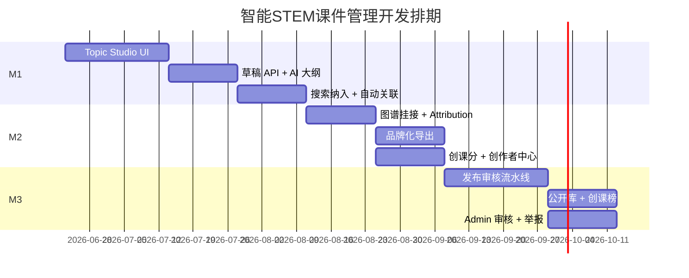

# 智能STEM课件管理 — 开发计划

> **关联 PRD**：[09-intelligent-courseware-management-v2.md](../docs/requirements/09-intelligent-courseware-management-v2.md)  
> **创建日期**：2026-06-21  
> **预计周期**：M1–M3 共 16 周（可按人力并行压缩）

---

## 1. 目标摘要

将桌面端从「资源浏览器」升级为 **智能STEM课件管理与教学图谱编排平台**，交付：

1. 课题工作室（Topic Studio）六步向导  
2. 搜索 → 纳入教程闭环  
3. 课件自动关联 + 图谱挂接  
4. 发布审核 + 创课分激励  

**明确不开发**：Blockly / 内置编辑器集成（已有代码标记 deprecated，后续 M4 清理）。

---

## 2. 里程碑总览

| 里程碑 | 周期 | 交付物 | 验收 |
|--------|------|--------|------|
| **M1 能用** | 第 1–6 周 | Topic Studio 骨架 + 搜索纳入 + 规则版自动关联 | 教师可完成课题→教程→挂课件 |
| **M2 可编排** | 第 7–10 周 | 图谱自动挂接 + 品牌化导出 + CC 积分 | 教程出现在图谱；积分可见 |
| **M3 可生态** | 第 11–16 周 | 发布审核 + 公开库 + 创课榜 + Admin 审核台 | 公开发布闭环跑通 |

---

## 3. M1：能用（第 1–6 周）

### 3.1 产品任务

| # | 任务 | 负责层 | 优先级 | 依赖 |
|---|------|--------|--------|------|
| M1-1 | Topic Studio 路由与六步向导 UI 壳 | Desktop | P0 | — |
| M1-2 | 课题草稿 CRUD（本地 SQLite + 可选云端） | Desktop + Backend | P0 | M1-1 |
| M1-3 | AI 大纲生成（接现有 API 配置 / 后端 proxy） | Backend + Desktop | P0 | M1-2 |
| M1-4 | 确认教程 → 写入教程库（复用 Tauri create_course） | Desktop | P0 | M1-3 |
| M1-5 | Step 4 资源匹配面板（调用 smart_search + 本地树 + 硬件 API） | Desktop | P0 | M1-4 |
| M1-6 | 全网搜 / 全局搜结果「加入当前教程」 | Desktop | P0 | M1-4 |
| M1-7 | 课件上传后规则版自动关联建议（关键词/学科匹配） | Desktop | P0 | 已有 upload dialog |
| M1-8 | 侧边栏入口：课题工作室；Dashboard 卡片 | Desktop | P1 | M1-1 |
| M1-9 | Blockly 路由隐藏/deprecated 注释 | Desktop | P2 | — |

### 3.2 技术任务

**Desktop (`desktop-manager`)**

```
src/app/features/topic-studio/
  topic-studio.component.ts          # 向导容器
  steps/
    topic-input-step.component.ts      # Step 1
    ai-outline-step.component.ts       # Step 2
    confirm-tutorial-step.component.ts # Step 3
    resource-match-step.component.ts   # Step 4
    branding-step.component.ts         # Step 5 占位
    publish-step.component.ts            # Step 6 占位
  topic-studio.service.ts              # 草稿状态机
  topic-studio.models.ts
```

**Backend (`backend-next`)**

```
app/api/v1/topic-studio/
  drafts/route.ts                      # GET/POST 草稿
  drafts/[id]/generate-outline/route.ts
  drafts/[id]/match-resources/route.ts
  drafts/[id]/confirm/route.ts
```

**Prisma 增量**

```prisma
model TopicDraft { ... }
model TutorialPackage { ... }
```

### 3.3 M1 验收清单

- [ ] `/topic-studio` 六步可导航，草稿断点续做  
- [ ] AI 生成大纲并可编辑确认  
- [ ] 确认后教程出现在统一资源库「本地教程」  
- [ ] 搜索结果显示「加入教程」并写入关联  
- [ ] 上传课件后弹出关联建议（≥1 条）  
- [ ] E2E：topic-studio 基础流程 1 条  

---

## 4. M2：可编排（第 7–10 周）

### 4.1 产品任务

| # | 任务 | 负责层 | 优先级 |
|---|------|--------|--------|
| M2-1 | 教程确认后自动创建/更新图谱节点 | Backend + Desktop | P0 |
| M2-2 | 图谱节点反查教程与课件 | Desktop | P1 |
| M2-3 | ResourceAttribution 来源链存储 | Backend | P0 |
| M2-4 | 品牌模板 CRUD（Logo/水印/页脚） | Desktop + Backend | P1 |
| M2-5 | PDF 封面页 + 页脚水印导出（Tauri/Rust 或后端） | Desktop | P1 |
| M2-6 | 教学包导出（元数据 JSON + 课件清单） | Desktop | P1 |
| M2-7 | CreatorProfile + CreditLedger 数据模型 | Backend | P0 |
| M2-8 | 创课分计分 hook（保存/上传/挂接/发布） | Backend | P0 |
| M2-9 | 创作者中心页面 `/creator-center` | Desktop | P0 |
| M2-10 | AI 关联建议升级（LLM 辅助，可选） | Backend | P2 |

### 4.2 API 增量

| 路径 | 说明 |
|------|------|
| `POST /api/v1/knowledge-graph/nodes/link-tutorial` | 教程挂图谱 |
| `GET /api/v1/creators/me` | 创作者概览 |
| `GET /api/v1/creators/ledger` | 积分流水 |
| `POST /api/v1/materials/auto-link` | AI/规则关联建议 |

### 4.3 M2 验收清单

- [ ] 确认教程后图谱 Tab 可见新节点  
- [ ] 引用外链课件必填 attribution  
- [ ] 品牌模板可保存并应用于导出  
- [ ] 创作者中心显示 CC、等级、流水  
- [ ] 保存教程 +30 分等行为可验证  

---

## 5. M3：可生态（第 11–16 周）

### 5.1 产品任务

| # | 任务 | 负责层 | 优先级 |
|---|------|--------|--------|
| M3-1 | 发布范围选择（私有/校内/公开） | Desktop + Backend | P0 |
| M3-2 | 发布前版权确认流程 | Desktop | P0 |
| M3-3 | 自动审核（元数据/重复度/来源链） | Backend | P0 |
| M3-4 | Admin Web 发布审核队列 | Admin | P1 |
| M3-5 | 公开资源库浏览（Desktop + Website 列表） | Desktop + Website | P1 |
| M3-6 | 创课榜 / 月度榜单 | Backend + Desktop | P1 |
| M3-7 | 数字证书 PDF 生成 | Backend | P2 |
| M3-8 | 精选标记 + 额外 CC 结算 | Admin + Backend | P1 |
| M3-9 | 抄袭举报入口 + 扣罚逻辑 | Backend + Admin | P1 |
| M3-10 | 激励 T+7 延迟发放 job | Backend | P1 |

### 5.2 M3 验收清单

- [ ] 公开发布需审核通过后才可见  
- [ ] 公开库可搜索已发布教程包  
- [ ] 创课榜 Top N 展示  
- [ ] 抄袭举报 → 管理员处理 → 积分扣罚  
- [ ] PRD §8 全部验收项通过  

---

## 6. 并行工作与依赖



### 6.1 可并行

| 轨道 A | 轨道 B |
|--------|--------|
| Desktop Topic Studio UI | Backend 草稿/包 API |
| 搜索纳入教程 | Prisma 模型迁移 |
| 创作者中心 UI | Admin 审核台 |

### 6.2 关键依赖

- M2 图谱挂接依赖闭包表/概念 API（已有 PostgreSQL 迁移 ✅）  
- M1 AI 大纲依赖 `api_config` 或后端统一 LLM proxy  
- M3 公开发布依赖 M2 attribution 与 CC 体系  

---

## 7. 代码清理（M4 ✅ 2026-06-21）

| 项 | 动作 | 状态 |
|----|------|------|
| `blockly-editor/` | 删除组件，移除 npm `blockly` 依赖 | ✅ |
| `hardware-projects/:id/editor` 路由 | 保留 redirect → 列表（兼容旧链接） | ✅ |
| FR-3.5.3 文档 | 已更新为 Out of Scope | ✅ |

---

## 8. 测试策略

| 层级 | 范围 |
|------|------|
| 单元 | topic-studio.service 状态机、CC 计分规则 |
| E2E | Topic Studio 六步、搜索纳入、发布流程 |
| 集成 | 草稿 API ↔ Desktop ↔ 图谱节点 |
| 人工 | 版权 attribution 展示、水印导出效果 |

**E2E 新增 spec**：`desktop-manager/tests/scenarios/topic-studio.spec.js`

---

## 9. 风险与缓解

| 风险 | 缓解 |
|------|------|
| AI 生成质量不稳定 | 大纲模板 + 用户必审；流式输出 |
| 版权纠纷 | 强制 attribution；发布协议；举报机制 |
| 激励刷分 | hash 去重、T+7 延迟、新账号冷却 |
| 图谱 API 与 Desktop 不同步 | M2 优先打通 link-tutorial 单一入口 |
| 范围膨胀 | M1 不做品牌化/发布；M2 不做公开库 |

---

## 10. 下一步（立即执行）

1. **Week 1**：创建 `topic-studio` 模块骨架 + 路由 + 侧边栏入口  
2. **Week 1–2**：Prisma `TopicDraft` 模型 + 草稿 API  
3. **Week 2–3**：Step 1–3 UI + AI 大纲对接  
4. **Week 3–4**：Step 4 资源匹配 + 搜索「加入教程」  
5. **Week 5–6**：规则版 auto-link + M1 E2E + 验收  

---

## 11. 文档同步

| 文档 | 动作 |
|------|------|
| `docs/requirements/09-*.md` | ✅ 已创建 |
| `docs/requirements/03-functional-requirements.md` | ✅ 增量 FR-ICM |
| `docs/requirements/07-roadmap-and-status.md` | ✅ Phase 2.5 里程碑 |
| `docs/requirements/01-project-overview.md` | ✅ 定位更新 |
| `docs/requirements/README.md` | ✅ 索引更新 |

---

*计划负责人：开发团队；每里程碑结束更新本文 §3–§5 验收清单勾选状态。*
