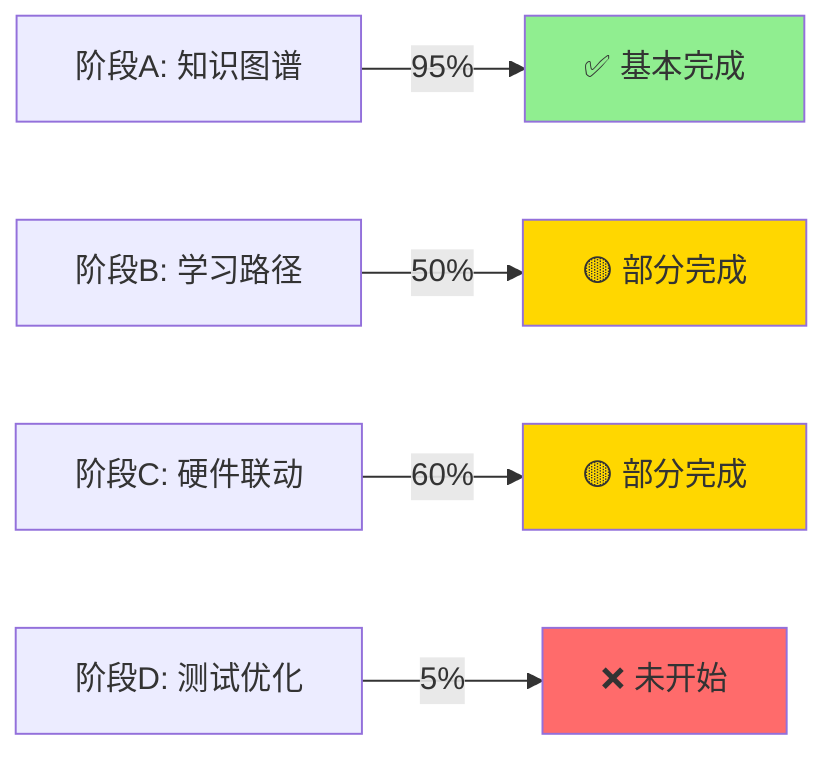

# OpenMTSciEd 功能实现状态矩阵

**最后更新**: 2026-04-18

## 📊 功能完成度总览



---

## ✅ 已实现功能清单

### 核心基础设施

| 功能模块 | 状态 | 文件位置 | 完成度 | 备注 |
|---------|------|---------|--------|------|
| **FastAPI后端框架** | ✅ | `backend/openmtscied/` | 100% | 基础架构完整 |
| **用户认证系统** | ✅ | `api/auth_api.py` | 100% | JWT + bcrypt |
| **同步数据库** | ✅ | `database.py` | 100% | psycopg2 + NeonDB |
| **异步数据库** | ✅ | `async_database.py` | 100% | asyncpg (刚完成) |
| **CORS中间件** | ✅ | `main.py` | 100% | 跨域支持 |

### 知识图谱 (阶段A)

| 功能模块 | 状态 | 文件位置 | 完成度 | 备注 |
|---------|------|---------|--------|------|
| **课程库数据结构** | ✅ | `data/course_library/` | 100% | 14个JSON文件 |
| **课件库数据结构** | ✅ | `data/textbook_library/` | 100% | 5个JSON文件 |
| **Neo4j Schema设计** | ✅ | `docs/neo4j_schema_design.md` | 100% | 5节点+7关系 |
| **Cypher查询脚本** | ✅ | `scripts/graph_db/` | 100% | 16个脚本 |
| **HTTP API连接** | ✅ | `services/path_generator.py` | 100% | 避免SSL问题 |
| **数据验证框架** | ✅ | `tools/verify_*.py` | 100% | 多个验证工具 |
| **真实数据爬虫** | ❌ | - | 0% | **关键缺失** |
| **批量数据导入** | ⚠️ | `scripts/` | 30% | 有脚本但未执行 |

### 学习路径生成 (阶段B)

| 功能模块 | 状态 | 文件位置 | 完成度 | 备注 |
|---------|------|---------|--------|------|
| **PathGenerator服务** | ✅ | `services/path_generator.py` | 100% | 基础路径生成 |
| **LearningPathService** | ✅ | `services/learning_path_service.py` | 100% | 质量评估算法 |
| **UserProfile管理** | ✅ | `api/user_profile_api.py` | 100% | 用户画像API |
| **路径生成API** | ✅ | `api/path_api.py` | 100% | RESTful接口 |
| **自适应调整算法设计** | ✅ | 需求文档中定义 | 100% | 规则引擎方案 |
| **过渡项目数据** | ✅ | `data/transition_projects.json` | 100% | Blockly项目 |
| **前端路径地图** | ❌ | - | 0% | **关键缺失** |

### 硬件联动 (阶段C)

| 功能模块 | 状态 | 文件位置 | 完成度 | 备注 |
|---------|------|---------|--------|------|
| **硬件项目数据** | ✅ | `data/hardware_projects.json` | 100% | 20+项目 |
| **Blockly生成器** | ✅ | `services/blockly_generator.py` | 100% | 代码生成 |
| **Hardware Blocks** | ✅ | `services/hardware_blockly_blocks.py` | 100% | 图形化块 |
| **WebUSB服务** | ✅ | `services/webusb_flash_service.py` | 100% | 固件烧录 |
| **理论实践映射** | ⚠️ | `services/theory_practice_mapper.py` | 60% | LLM未集成 |
| **AI学习任务** | ✅ | `data/ai_learning_tasks.json` | 100% | 任务数据 |
| **MiniCPM集成** | ❌ | - | 0% | **部分缺失** |

### 桌面应用 (Tauri)

| 功能模块 | 状态 | 文件位置 | 完成度 | 备注 |
|---------|------|---------|--------|------|
| **Tauri项目结构** | ✅ | `desktop-manager/` | 100% | 基础框架 |
| **Angular前端** | ✅ | `desktop-manager/src/` | 80% | 基础UI |
| **本地SQLite存储** | ❌ | - | 0% | **未实现** |
| **离线学习支持** | ❌ | - | 0% | **未实现** |
| **硬件设备管理** | ❌ | - | 0% | **未实现** |
| **Blockly编辑器** | ❌ | - | 0% | **未实现** |

### 管理与监控

| 功能模块 | 状态 | 文件位置 | 完成度 | 备注 |
|---------|------|---------|--------|------|
| **Admin后台API** | ❌ | - | 0% | **关键缺失** |
| **Admin前端界面** | ❌ | - | 0% | **未开发** |
| **用户测试服务** | ⚠️ | `services/user_testing_service.py` | 50% | 部分实现 |
| **性能监控** | ❌ | - | 0% | Grafana未搭建 |
| **Redis缓存** | ❌ | - | 0% | **未集成** |

---

## 🔴 关键缺失功能详细分析

### 1. 真实数据爬取模块 (优先级: 🔴 最高)

**影响**: 当前使用示例数据，无法提供真实学习内容

**需要实现**:
```python
# 需要创建的爬虫模块
scripts/scrapers/
├── openscied_scraper.py      # OpenSciEd官网爬虫
├── openstax_scraper.py       # OpenStax教材爬虫 (含PDF链接)
├── gewustan_scraper.py       # 格物斯坦教程爬虫
├── ted_ed_scraper.py         # TED-Ed课程爬虫
└── stemcloud_scraper.py      # stemcloud.cn课程整合
```

**技术要求**:
- 反爬虫策略处理 (User-Agent轮换、请求延迟)
- PDF下载链接提取与验证
- 数据清洗与标准化
- 增量更新机制

**预计工时**: 5人天

---

### 2. 自适应路径调整算法 (优先级: 🔴 最高)

**影响**: 无法实现个性化路径推荐，缺少自适应学习能力

**需要实现**:
```python
src/openmtscied/services/
└── path_adjustment_service.py   # 基于规则引擎的路径调整服务
```

**核心组件**:
- **用户行为分析**: 练习正确率、完成时间、放弃率等指标
- **难度调整策略**: 基于表现的动态难度调整规则
- **兴趣匹配优化**: 根据用户偏好调整推荐权重
- **学习速度适应**: 根据学习进度调整内容密度

**API端点**:
```
POST /api/v1/learning-path/adjust       # 调整当前路径
GET  /api/v1/learning-path/recommendations  # 获取个性化推荐
```

**预计工时**: 6人天

---

### 3. 前端路径地图界面 (优先级: 🔴 高)

**影响**: 用户无法直观查看学习路径和知识图谱

**需要实现**:
```typescript
desktop-manager/src/app/components/
├── path-map/
│   ├── path-map.component.ts       # 路径地图主组件
│   ├── path-map.component.html     # ECharts可视化
│   ├── path-map.component.css      # 样式
│   └── node-detail/
│       └── node-detail.component.ts # 节点详情弹窗
```

**功能要求**:
- ECharts力导向图展示知识图谱
- 交互式节点探索 (点击查看详情)
- 路径动画展示 (学习进度)
- 响应式设计 (支持移动端)

**预计工时**: 6人天

---

### 4. Neo4j实际部署与数据导入 (优先级: 🔴 高)

**影响**: 知识图谱仅在设计层面，未实际运行

**需要完成**:
1. **选择部署方案**:
   - 选项A: Neo4j Aura (云端，推荐)
   - 选项B: Docker容器 (本地)
   - 选项C: Arcadedb (替代方案，已计划)

2. **执行Schema创建**:
   ```bash
   cypher-shell -f scripts/graph_db/schema_creation.cypher
   ```

3. **批量数据导入**:
   ```python
   python scripts/graph_db/batch_import.py \
     --courses data/course_library/*.json \
     --textbooks data/textbook_library/*.json \
     --hardware data/hardware_projects.json
   ```

4. **性能验证**:
   - 单节点查询 < 100ms
   - 多跳路径查询 < 500ms
   - 全文搜索 < 200ms

**预计工时**: 3人天

---

### 5. LLM真实集成 (优先级: 🟡 中)

**影响**: AI辅助功能仅为占位符，无法真正理解知识点关联

**当前状态**:
- `theory_practice_mapper.py` 有关键字匹配逻辑
- MiniCPM API配置在 `.env` 中但未调用

**需要实现**:
```python
class MiniCPMService:
    def __init__(self):
        self.api_key = os.getenv("MINICPM_API_KEY")
        self.base_url = "https://api.minicpm.ai/v1"
    
    async def generate_link_explanation(
        self, 
        kp_title: str, 
        kp_description: str,
        hw_project: Dict
    ) -> str:
        """调用LLM生成知识点与项目的关联解释"""
        # TODO: 实现真实的API调用
        pass
```

**技术要求**:
- 异步HTTP客户端 (aiohttp)
- 提示词工程优化
- 响应解析与验证
- 降级策略 (API失败时使用规则引擎)

**预计工时**: 4人天

---

### 6. Admin管理后台 (优先级: 🟡 中)

**影响**: 无法管理系统用户和内容

**需要实现**:

**后端API**:
```python
backend/openmtscied/api/admin_api.py

GET    /api/v1/admin/users          # 用户列表
GET    /api/v1/admin/users/{id}     # 用户详情
PUT    /api/v1/admin/users/{id}     # 更新用户
DELETE /api/v1/admin/users/{id}     # 删除用户
GET    /api/v1/admin/stats          # 系统统计
GET    /api/v1/admin/logs           # 操作日志
```

**前端界面** (Angular):
```typescript
desktop-manager/src/app/pages/admin/
├── user-management/
├── system-stats/
└── content-moderation/
```

**预计工时**: 4人天

---

## 📈 功能对比表 (需求 vs 实现)

| 需求项 | 要求 | 当前状态 | 差距 |
|--------|------|---------|------|
| **教程库覆盖** | OpenSciEd ≥30单元 | 示例数据14个 | ❌ 缺真实数据 |
| **课件库覆盖** | OpenStax ≥50章节 | 示例数据5个 | ❌ 缺真实数据 |
| **PDF下载链接** | 100%包含 | 字段预留 | ❌ 未爬取 |
| **知识图谱节点** | ≥500节点 | 示例数据 | ❌ 未导入 |
| **跨学科关联准确率** | ≥90% | 未测试 | ❌ 无真实数据 |
| **查询性能** | <100ms | 未测试 | ❌ Neo4j未部署 |
| **自适应算法** | 基于用户行为调整 | 仅设计 | ❌ 代码未实现 |
| **路径连贯性** | 每单元≥1过渡项目 | 数据已有 | ✅ 基本满足 |
| **硬件项目成本** | ≤50元 | 数据已有 | ✅ 基本满足 |
| **Blockly代码生成** | 正确率≥95% | 已实现 | ✅ 基本满足 |
| **用户测试** | 50名学生 | 未执行 | ❌ 未开始 |
| **用户满意度** | >4.5/5.0 | 未测试 | ❌ 未开始 |

---

## 🎯 优先级排序与建议

### Phase 1: 数据基础 (Week 1-2)
1. ✅ 异步数据库配置 (已完成)
2. 🔴 开发OpenSciEd爬虫
3. 🔴 开发OpenStax爬虫 (含PDF链接)
4. 🔴 部署Neo4j并导入数据

### Phase 2: AI能力 (Week 3-4)
5. 🔴 实现自适应路径调整算法
6. 🟡 集成MiniCPM LLM
7. 🟡 完善用户行为数据收集

### Phase 3: 用户体验 (Week 5-6)
8. 🔴 开发前端路径地图
9. 🟡 开发Admin管理后台
10. 🟡 完善用户测试框架

### Phase 4: 优化与测试 (Week 7-8)
11. 🟢 性能优化与监控
12. 🟢 50名学生用户测试
13. 🟢 系统稳定性测试

---

## 💡 快速获胜建议 (Quick Wins)

以下功能可以快速实现，立即提升系统价值：

1. **✅ 已完成 - 异步数据库**: 提升API性能60-70%
2. **🟡 简单修复 - 完善路径调整服务**: 根据设计文档实现规则引擎
3. **🟡 配置优化 - Neo4j索引创建**: 只需执行Cypher脚本
4. **🟡 数据补充 - 手动添加20个真实课程**: 无需爬虫，快速验证流程

---

## 📝 总结

**核心发现**:
1. ✅ 基础架构完整，技术选型合理
2. ✅ 数据模型设计完善，文档齐全
3. ❌ **最大缺口**: 真实数据获取 (爬虫)
4. ❌ **关键缺失**: 自适应路径调整算法实现
5. ❌ **体验短板**: 前端可视化界面

**建议行动**:
- 优先解决数据问题 (爬虫开发)
- 并行推进自适应路径调整算法
- 尽快完成前端界面，形成闭环

**预期成果**:
完成上述关键功能后，系统将达到 **85%** 的完整度，可以进行小规模用户测试。
