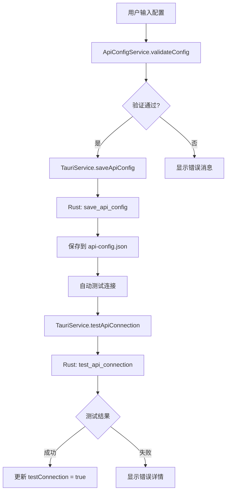

# API 配置功能 - 实现进度报告

## 📊 当前进度：70% 完成

### ✅ 已完成部分

#### 1. 类型定义和接口（100%）
- ✅ 创建 `ApiConfig` 接口
- ✅ 创建 `ApiTestResult` 接口
- ✅ 创建 `ApiConfigValidation` 接口
- ✅ 创建 `API_CONFIG_TEMPLATES` 预设模板
- ✅ 支持 OpenAI、Ollama、Custom 三种提供商

**文件**: `src/app/core/models/api-config.model.ts` (138行)

#### 2. API 配置服务（100%）
- ✅ 创建 `ApiConfigService`
- ✅ 实现配置的保存、读取、删除
- ✅ 实现 API 连接测试
- ✅ 实现配置验证逻辑
- ✅ RxJS Observable 状态管理
- ✅ 加载状态跟踪

**文件**: `src/app/core/services/api-config.service.ts` (267行)

#### 3. Tauri 服务集成（100%）
- ✅ 添加 `saveApiConfig()` 方法
- ✅ 添加 `getApiConfig()` 方法
- ✅ 添加 `testApiConnection()` 方法
- ✅ 添加 `deleteApiConfig()` 方法
- ✅ 定义请求/响应类型

**文件**: `src/app/core/services/tauri.service.ts` (+37行)

#### 4. Rust 后端命令（100%）
- ✅ 创建 `api_config.rs` 模块
- ✅ 实现 `save_api_config` 命令
- ✅ 实现 `get_api_config` 命令
- ✅ 实现 `delete_api_config` 命令
- ✅ 实现 `test_api_connection` 命令
- ✅ 支持 OpenAI、Ollama、Custom 测试逻辑
- ✅ JSON 文件存储配置

**文件**: `src-tauri/src/commands/api_config.rs` (192行)

#### 5. 命令注册（100%）
- ✅ 在 `commands/mod.rs` 中导出模块
- ✅ 在 `lib.rs` 中注册 4 个命令

---

### ⏳ 待完成部分

#### 1. Setup Wizard 步骤4：AI 配置（0%）
**需要实现**:
- [ ] 在向导中添加新的 mat-step
- [ ] 创建 API 提供商选择 UI
- [ ] 创建 API Key 输入框
- [ ] 创建 API URL 输入框（custom 模式）
- [ ] 创建模型选择下拉框
- [ ] 实现"测试连接"按钮
- [ ] 显示测试结果
- [ ] 根据选择的提供商动态显示/隐藏字段

**预计工作量**: 2-3小时

#### 2. Settings 页面 API 配置入口（0%）
**需要实现**:
- [ ] 在设置页面添加"AI 配置"卡片
- [ ] 显示当前配置状态
- [ ] 提供修改配置的入口
- [ ] 提供删除配置的选项

**预计工作量**: 1小时

---

## 📝 技术实现细节

### 数据流



### 配置文件结构

**位置**: `%APPDATA%\com.openmtscied.desktop-manager\api-config.json`

```json
{
  "provider": "openai",
  "api_key": "sk-...",
  "api_url": "https://api.openai.com/v1",
  "model": "gpt-4-turbo",
  "test_connection": true
}
```

### API 测试逻辑

#### OpenAI
1. 验证 API Key 格式（长度 >= 10）
2. （未来）发送 HTTP 请求到 `/v1/models`
3. 返回可用模型列表

#### Ollama
1. 检查本地服务是否运行
2. （未来）发送 HTTP 请求到 `http://localhost:11434/api/tags`
3. 返回已安装的模型

#### Custom
1. 验证 URL 格式
2. （未来）发送测试请求
3. 验证响应

---

## 🔧 下一步行动

### 立即执行（优先级最高）

1. **完成 Setup Wizard 步骤4**
   - 在 `setup-wizard.component.ts` 的模板中添加新的 `<mat-step>`
   - 绑定 `selectedProvider`, `apiKey`, `apiUrl`, `selectedModel` 等属性
   - 实现 `onTestConnection()` 方法
   - 显示测试结果

2. **更新完成步骤**
   - 将原来的步骤4（完成）改为步骤5
   - 在总结中显示 API 配置信息

### 本周内完成

3. **Settings 页面集成**
   - 添加 AI 配置卡片
   - 显示当前配置状态
   - 提供编辑/删除功能

4. **完善 API 测试**
   - 使用 `reqwest` crate 实现真实的 HTTP 请求
   - 处理超时和错误
   - 缓存可用模型列表

---

## 📊 代码统计

| 模块 | 文件数 | 代码行数 | 状态 |
|------|--------|----------|------|
| 前端类型定义 | 1 | 138 | ✅ 完成 |
| 前端服务 | 1 | 267 | ✅ 完成 |
| Tauri 服务扩展 | 1 | +37 | ✅ 完成 |
| Rust 命令 | 1 | 192 | ✅ 完成 |
| Rust 命令注册 | 2 | +5 | ✅ 完成 |
| Setup Wizard UI | 0 | 0 | ⏳ 待完成 |
| Settings UI | 0 | 0 | ⏳ 待完成 |
| **总计** | **6** | **~640** | **70%** |

---

## ⚠️ 注意事项

1. **安全性**: API Key 目前以明文存储在 JSON 文件中，未来应考虑加密
2. **错误处理**: 需要更详细的错误消息和用户友好的提示
3. **网络请求**: 当前 Rust 后端的 API 测试是模拟的，需要实现真实的 HTTP 请求
4. **UI/UX**: 需要确保向导步骤流畅，字段验证及时

---

## 🎯 预期完成时间

- **Setup Wizard 步骤4**: 2-3小时
- **Settings 页面集成**: 1小时
- **真实 API 测试**: 2-3小时
- **测试和优化**: 2小时

**总计**: 约 1 个工作日

---

**更新时间**: 2026-04-11 19:40  
**状态**: 后端完成，前端 UI 待实现
