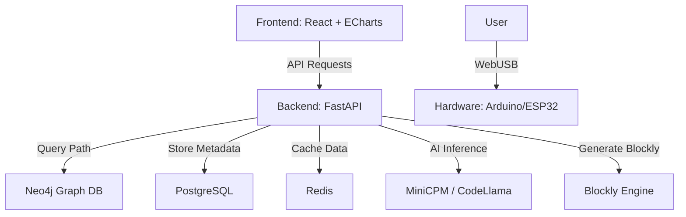

# System Architecture

## Components

1. **Frontend**: Built with Vite, React, and TypeScript. Visualizes the STEM knowledge graph.
2. **Backend**: Python FastAPI service handling path generation and user profiles.
3. **Knowledge Graph**: Neo4j database storing relationships between course units, textbook chapters, and hardware projects.
4. **AI Engine**: Integrates LLMs for concept explanation and code generation.
5. **Hardware Layer**: Supports WebUSB for direct browser-to-device communication.
