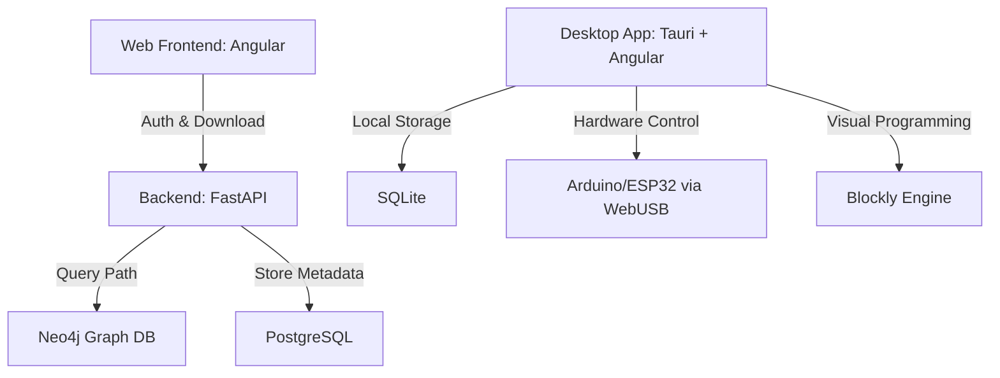

# System Architecture

## Components

1. **Web Portal**: Minimalist marketing site for user registration and app download.
2. **Desktop Client**: Core learning environment built with Tauri (Rust) and Angular.
3. **Path Engine**: Python FastAPI service that generates STEM learning paths from Neo4j.
4. **Knowledge Graph**: Neo4j database linking tutorials, textbooks, and hardware projects.
5. **Hardware Layer**: Local communication with microcontrollers via WebUSB.
