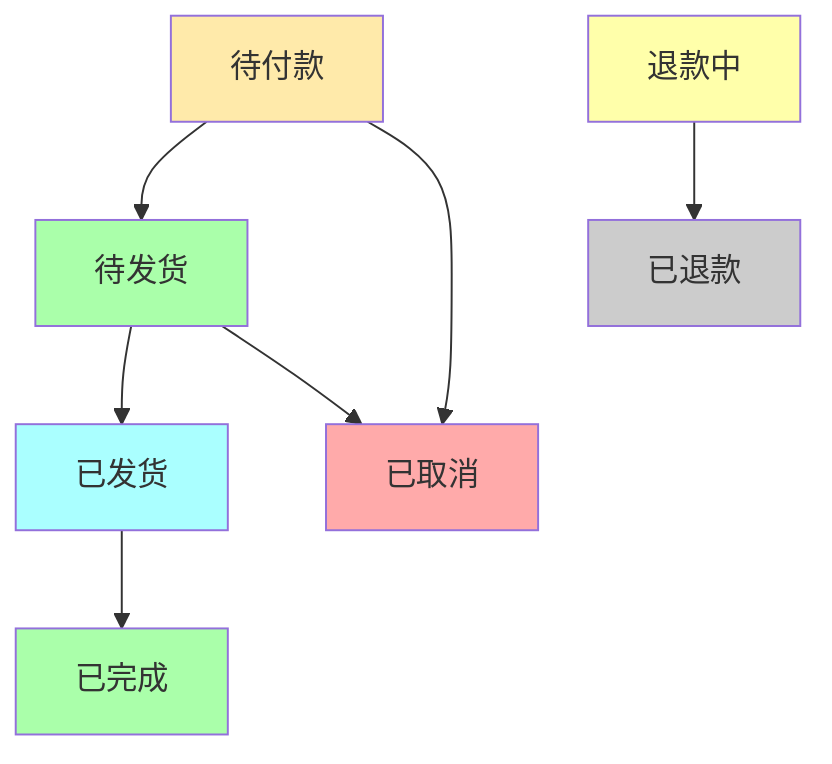

# 硬件作品商城支付系统

## 📋 系统概述

硬件作品商城支付系统是一个完整的电商支付解决方案，支持多种支付方式，提供订单管理、支付处理、状态跟踪等功能。

## 🏗️ 系统架构

### 核心组件

1. **支付服务 (PaymentService)**
   - 订单创建和管理
   - 支付处理和状态跟踪
   - 多种支付方式支持

2. **支付网关 (PaymentGateway)**
   - 微信支付集成
   - 支付宝集成
   - 银行卡支付
   - 余额支付

3. **订单管理 (OrderManager)**
   - 订单状态流转
   - 自动超时处理
   - 发货和完成处理

4. **前端服务 (EcommerceService)**
   - Angular购物车管理
   - 支付流程处理
   - 订单查询和管理

## 🔧 技术栈

### 后端
- **框架**: FastAPI (Python)
- **数据库**: SQLAlchemy (异步)
- **支付网关**: 微信支付、支付宝SDK
- **队列**: Celery (计划中)

### 前端
- **框架**: Angular
- **状态管理**: RxJS BehaviorSubject
- **HTTP客户端**: Angular HttpClient

## 🚀 快速开始

### 1. 安装依赖

```bash
# 后端依赖已在requirements.txt中包含
pip install -r backend/requirements.txt
```

### 2. 数据库迁移

```bash
# 创建支付相关表
cd backend
alembic revision --autogenerate -m "add payment tables"
alembic upgrade head
```

### 3. 配置支付参数

```python
# backend/config/settings.py
PAYMENT_CONFIG = {
    'wechat_pay': {
        'app_id': 'your_wechat_app_id',
        'mch_id': 'your_merchant_id',
        'api_key': 'your_api_key',
        'notify_url': 'https://your-domain.com/api/payments/wechat/callback'
    },
    'alipay': {
        'app_id': 'your_alipay_app_id',
        'private_key': 'your_private_key',
        'public_key': 'your_public_key',
        'notify_url': 'https://your-domain.com/api/payments/alipay/callback'
    }
}
```

### 4. 启动服务

```bash
# 启动FastAPI服务
cd backend
uvicorn main:app --reload --port 8000
```

## 🛒 前端集成示例

### 1. 购物车管理

```typescript
import { EcommerceService } from './core/services/ecommerce.service';

@Component({
  selector: 'app-shopping-cart',
  templateUrl: './shopping-cart.component.html'
})
export class ShoppingCartComponent {
  cartItems$ = this.ecommerceService.cartItems$;
  cartTotal$ = this.ecommerceService.cartTotal$;

  constructor(private ecommerceService: EcommerceService) {}

  addToCart(product: any) {
    this.ecommerceService.addToCart({
      productId: product.id,
      productName: product.name,
      price: product.price,
      quantity: 1,
      imageUrl: product.image,
      description: product.description
    });
  }

  checkout() {
    const items = this.ecommerceService.getCartItems();
    const total = this.ecommerceService.getCartTotal();
    
    // 跳转到结算页面
    this.router.navigate(['/checkout'], {
      state: { items, total }
    });
  }
}
```

### 2. 支付流程

```typescript
// checkout.component.ts
export class CheckoutComponent implements OnInit {
  cartItems: CartItem[] = [];
  totalAmount: number = 0;
  selectedPaymentMethod: PaymentMethod = PaymentMethod.WECHAT_PAY;
  
  paymentMethods$ = this.ecommerceService.getPaymentMethods();

  constructor(
    private ecommerceService: EcommerceService,
    private router: Router
  ) {}

  async processPayment() {
    try {
      const response = await this.ecommerceService.checkout(
        this.cartItems,
        this.selectedPaymentMethod,
        this.shippingAddress,
        this.orderNote
      );

      if (response.status === 'success') {
        // 支付成功处理
        this.router.navigate(['/payment-success'], {
          queryParams: { orderId: response.order_id }
        });
      } else {
        // 支付失败处理
        this.showError('支付失败，请重试');
      }
    } catch (error) {
      this.showError('支付过程中出现错误');
    }
  }
}
```

## 📊 API接口文档

### 支付相关接口

| 方法 | 路径 | 描述 |
|------|------|------|
| POST | `/api/v1/payments/checkout` | 结账支付 |
| GET | `/api/v1/payments/orders/{order_id}` | 获取订单详情 |
| GET | `/api/v1/payments/orders` | 获取订单列表 |
| POST | `/api/v1/payments/orders/{order_id}/cancel` | 取消订单 |
| GET | `/api/v1/payments/statistics` | 获取支付统计 |
| GET | `/api/v1/payments/payment-methods` | 获取支付方式 |
| GET | `/api/v1/payments/payment-status/{payment_id}` | 获取支付状态 |

### 请求示例

```bash
# 结账支付
curl -X POST "http://localhost:8000/api/v1/payments/checkout" \
  -H "Authorization: Bearer your-token" \
  -H "Content-Type: application/json" \
  -d '{
    "items": [
      {
        "productId": "prod_001",
        "productName": "Arduino开发板",
        "price": 199.00,
        "quantity": 1
      }
    ],
    "payment_method": "wechat_pay",
    "shipping_address": {
      "recipientName": "张三",
      "phone": "13800138000",
      "province": "广东省",
      "city": "深圳市",
      "district": "南山区",
      "detailAddress": "科技园南路1001号"
    }
  }'

# 获取订单列表
curl -X GET "http://localhost:8000/api/v1/payments/orders?limit=10&offset=0" \
  -H "Authorization: Bearer your-token"
```

## 💳 支付方式支持

### 1. 微信支付
- APP支付
- 小程序支付
- 扫码支付
- JSAPI支付

### 2. 支付宝
- APP支付
- 网页支付
- 扫码支付
- 当面付

### 3. 银行卡支付
- 借记卡
- 信用卡
- 网银支付

### 4. 余额支付
- 用户账户余额
- 积分抵扣
- 优惠券使用

## 🔄 订单状态流转



## 🔒 安全特性

### 1. 数据安全
- 敏感信息加密存储
- SSL/TLS传输加密
- 数据库访问控制

### 2. 支付安全
- 签名验证
- 回调验证
- 防重复支付
- 防篡改校验

### 3. 业务安全
- 权限控制
- 限流防护
- 日志审计
- 异常监控

## 🧪 测试

### 运行单元测试

```bash
cd backend
pytest tests/test_payment_service.py -v
```

### 测试覆盖率

```bash
pytest --cov=services tests/test_payment_service.py
```

### 模拟支付测试

```bash
# 使用模拟支付接口进行测试
curl -X POST "http://localhost:8000/api/v1/payments/simulate-payment" \
  -H "Authorization: Bearer test-token" \
  -H "Content-Type: application/json" \
  -d '{
    "order_id": "TEST_ORDER_001",
    "payment_method": "wechat_pay"
  }'
```

## 📈 监控和运维

### 关键指标
- 支付成功率
- 订单转化率
- 平均支付时间
- 退款率
- 系统响应时间

### 日志监控
```python
# 支付关键节点日志
logger.info(f"订单创建: {order_id}, 金额: {amount}")
logger.info(f"支付成功: {payment_id}, 方式: {payment_method}")
logger.error(f"支付失败: {payment_id}, 错误: {error_message}")
```

## 🚀 部署建议

### 生产环境配置

```yaml
# docker-compose.yml
version: '3.8'
services:
  payment-api:
    build: ./backend
    ports:
      - "8000:8000"
    environment:
      - DATABASE_URL=postgresql://user:pass@db:5432/payment
      - REDIS_URL=redis://redis:6379
    depends_on:
      - db
      - redis

  db:
    image: postgres:13
    environment:
      - POSTGRES_DB=payment
      - POSTGRES_USER=user
      - POSTGRES_PASSWORD=pass

  redis:
    image: redis:6-alpine
```

### 性能优化建议
- 数据库连接池配置
- Redis缓存热点数据
- CDN加速静态资源
- 负载均衡部署
- 异步任务处理

## 🤝 最佳实践

### 1. 前端最佳实践
```typescript
// 购物车持久化
ngOnInit() {
  this.ecommerceService.cartItems$.subscribe(items => {
    // 实时更新UI
    this.updateCartDisplay(items);
  });
}

// 支付状态轮询
startPaymentPolling(paymentId: string) {
  const interval = setInterval(async () => {
    const status = await this.ecommerceService.getPaymentStatus(paymentId);
    if (status.status === 'success') {
      clearInterval(interval);
      this.handlePaymentSuccess();
    }
  }, 3000);
}
```

### 2. 后端最佳实践
```python
# 幂等性保证
@app.post("/payments/checkout")
async def checkout(request: PaymentRequest):
    # 检查重复提交
    existing_payment = await get_existing_payment(request.order_id)
    if existing_payment:
        return existing_payment
    
    # 创建新支付
    return await create_new_payment(request)
```

## 📞 技术支持

如遇到问题，请查看：
- 📚 [API文档](/docs/API_DOCUMENTATION.md)
- 🐛 [问题追踪](https://github.com/your-org/imato/issues)
- 💬 [技术支持群](https://your-slack-channel.com)

---

*© 2024 iMato Hardware Store. 保留所有权利.*
