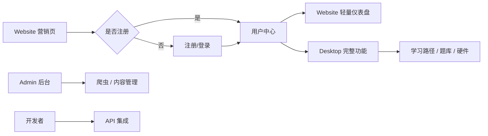

# 02 - 用户与场景

## 1. 目标用户

### 1.1 学生 / 自学者

| 属性 | 描述 |
|------|------|
| 需求 | 系统化学习 STEM，获得个性化路径与练习 |
| 主要触点 | Desktop Manager、Website 仪表盘 |
| 典型行为 | 注册登录 → 选择学科/年级 → 生成学习路径 → 做题练习 → 参与硬件项目 |

### 1.2 教师

| 属性 | 描述 |
|------|------|
| 需求 | 获取优质教学材料，设计课程计划 |
| 主要触点 | Website 开发者门户、Desktop Manager 资源浏览 |
| 典型行为 | 浏览教程/课件 → 筛选学科与年级 → 下载或关联到课程 → 查看硬件项目方案 |

### 1.3 开发者 / 集成方

| 属性 | 描述 |
|------|------|
| 需求 | 通过 API 集成 STEM 资源到自有产品（如 iMato） |
| 主要触点 | Website 开发者门户、API 文档 |
| 典型行为 | 阅读 API 文档 → 调用教程/知识图谱/硬件项目接口 → 构建第三方应用 |

### 1.4 平台管理员

| 属性 | 描述 |
|------|------|
| 需求 | 管理用户、内容、爬虫与系统配置 |
| 主要触点 | Admin Web 管理后台 |
| 典型行为 | 用户管理 → 触发/调度爬虫 → 维护课程与资源关联 → 导入题库 |

### 1.5 开源贡献者

| 属性 | 描述 |
|------|------|
| 需求 | 贡献代码、数据或文档 |
| 主要触点 | GitHub、项目文档 |
| 典型行为 | Fork → 开发功能/修复 Bug → 提交 PR |

## 2. 用户角色与权限

| 角色 | 标识 | 权限范围 |
|------|------|----------|
| 普通用户 | `user` | 浏览资源、学习路径、个人资料、练习 |
| 管理员 | `admin` | 上述全部 + 用户管理、爬虫、后台配置 |
| 匿名访客 | — | 公开 API、营销页、开发者门户浏览 |

> 认证基于 JWT；管理员接口需 `role: admin` 校验。

## 3. 典型使用场景

### 场景 A：新用户首次使用桌面端

```
访问 Desktop Manager
  → 注册/登录
  → 初始化向导（Setup Wizard）配置偏好
  → 进入仪表盘查看概览
  → 浏览教程库 / 课件库
  → 生成 AI 学习路径（Path Visualization）
```

**涉及模块**：认证、Setup Wizard、Dashboard、Tutorial Library、Path Visualization

### 场景 B：学生在网站快速查看进度

```
访问 website/index.html 了解产品
  → 点击登录 → 跳转 Desktop Manager 完成认证
  → 返回 website/dashboard.html 查看学习统计（轻量）
  → 需要完整功能时点击 CTA 打开 Desktop Manager
```

**涉及模块**：Website 导航、认证联动、Dashboard（模拟/待接 API）

### 场景 C：开发者集成 OpenMTSciEd API

```
阅读 developer.html API 文档 Tab
  → 调用 GET /api/v1/tutorials
  → 调用 POST /api/v1/knowledge-graph/path 生成路径
  → 在自有 Angular/React 应用中展示
```

**涉及模块**：Backend API、Website 开发者门户

### 场景 D：管理员扩充课程资源

```
登录 Admin Web
  → 教育平台管理：查看各平台同步状态
  → 爬虫管理：触发 Khan Academy / OpenStax / Coursera 爬虫
  → 课程管理：审核导入结果
  → 资源关联：维护知识点与课程/题目的关联关系
```

**涉及模块**：Admin Web、Crawler API、Education Platforms

### 场景 E：硬件项目实践

```
Desktop Manager → 硬件项目列表
  → 查看项目详情（难度、所需硬件、关联知识点）
  → 关联 Blockly 积木（blockly_hardware_blocks.json）
  → 在「我的项目」中跟踪进度
```

**涉及模块**：Hardware Projects、My Projects、Blockly 数据

### 场景 F：题库练习

```
Desktop Manager → 题库练习
  → 按学科/难度筛选题目
  → 作答并查看解析
  → 题库统计查看正确率与进度
```

**涉及模块**：Question Practice、Question Stats、Learning API

## 4. 用户旅程总览



## 5. 跨系统认证

- **Website ↔ Desktop Manager**：登录后 `localStorage` 共享 `user` 与 `access_token`
- **iMato 集成**：支持 `IMATO_SHARED_SECRET` 签发的跨系统 JWT（`verifyImatoToken`）
- **API 调用**：`Authorization: Bearer <token>` 访问受保护端点

## 6. 相关文档

- [功能需求](./03-functional-requirements.md)
- [非功能需求](./04-non-functional-requirements.md) — 安全与认证章节
