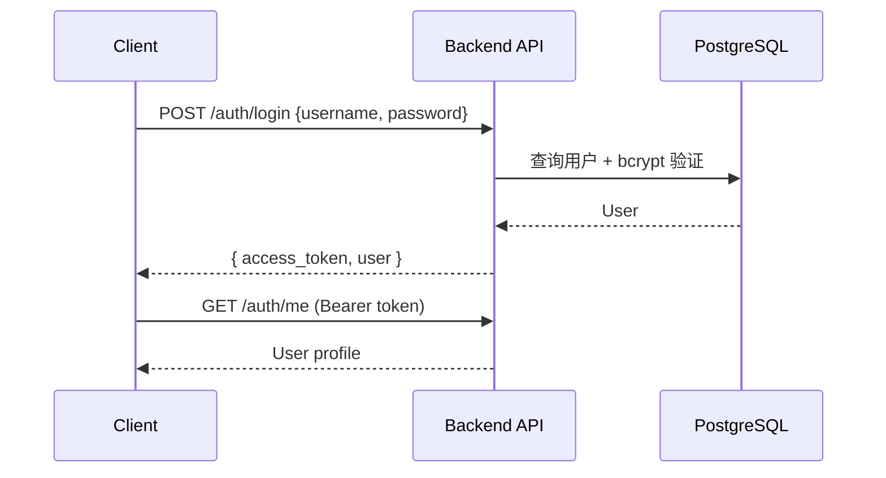
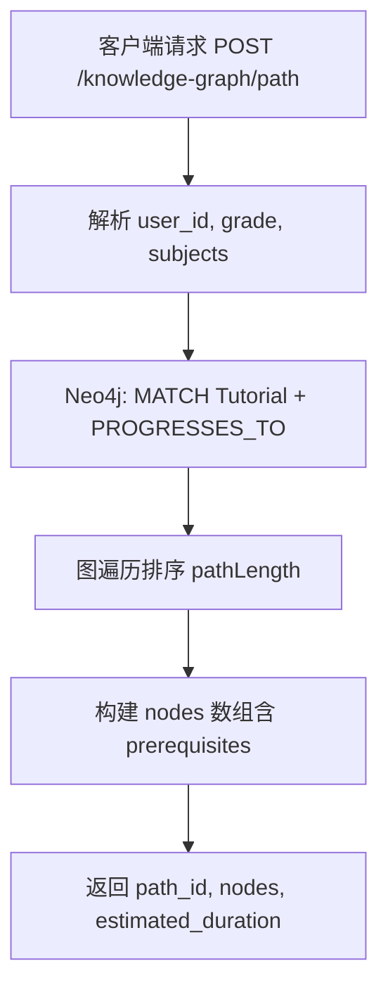

# 06 - 系统架构

## 1. 架构概览

OpenMTSciEd 采用**前后端分离、多端接入、双库存储**架构。

```
┌─────────────────────────────────────────────────────────────────┐
│                     客户端层 (Clients)                           │
├──────────────┬──────────────────┬───────────────────────────────┤
│   Website    │  Desktop Manager │        Admin Web              │
│  静态 HTML   │  Tauri + Angular │      Angular 21               │
│  营销/门户   │  完整学习应用     │      管理后台                  │
└──────┬───────┴────────┬─────────┴──────────────┬────────────────┘
       │                │                        │
       └────────────────┼────────────────────────┘
                        │ HTTP/REST (JSON)
                        │ Authorization: Bearer JWT
              ┌─────────▼─────────┐
              │   Backend API     │
              │   Next.js 16      │
              │   Port 3000       │
              │   /api/v1/*       │
              └─────────┬─────────┘
                        │
         ┌──────────────┼──────────────┐
         │              │              │
  ┌──────▼──────┐ ┌─────▼─────┐ ┌─────▼─────┐
  │ Neo4j Aura  │ │ PostgreSQL│ │ data/     │
  │ 知识图谱     │ │ (Prisma)  │ │ JSON 资产 │
  │ 教程/路径    │ │ 用户/题库  │ │ 爬虫输出  │
  └─────────────┘ └───────────┘ └───────────┘
```

---

## 2. 子项目说明

### 2.1 backend-next（后端 API）

| 属性 | 值 |
|------|-----|
| 路径 | `backend-next/` |
| 框架 | Next.js 16 App Router |
| 语言 | TypeScript |
| 职责 | REST API、认证、爬虫调度、Neo4j/Prisma 访问 |
| 部署 | Vercel Serverless |
| 端口 | 3000（开发） |

**目录结构**：
```
backend-next/
├── app/api/           # API 路由
│   ├── health/
│   └── v1/            # 版本化 API
├── lib/               # neo4j.ts, auth.ts, db.ts, crawlers/
├── prisma/            # schema.prisma
└── scripts/           # 测试与维护脚本
```

### 2.2 website（营销网站）

| 属性 | 值 |
|------|-----|
| 路径 | `website/` |
| 技术 | 静态 HTML / CSS / JavaScript |
| 职责 | 营销、开发者门户、轻量用户中心 |
| 部署 | Vercel Static / 任意静态托管 |
| 端口 | 8080（本地 python -m http.server） |

### 2.3 desktop-manager（桌面客户端）

| 属性 | 值 |
|------|-----|
| 路径 | `desktop-manager/` |
| 技术 | Tauri 2.0 + Angular 17 + Rust |
| 职责 | 学生学习主应用、本地 SQLite、离线能力 |
| 构建 | MSI / NSIS / DMG / AppImage |
| 端口 | 4200（Angular dev） |

**Tauri 插件**：
- tauri-plugin-fs — 文件系统
- tauri-plugin-dialog — 对话框
- tauri-plugin-sql — SQLite
- tauri-plugin-log — 日志

### 2.4 admin-web（管理后台）

| 属性 | 值 |
|------|-----|
| 路径 | `admin-web/` |
| 技术 | Angular 21 |
| 职责 | 用户、内容、爬虫、平台管理 |
| API 代理 | proxy.conf.json → localhost:3000 |

### 2.5 data（数据资产）

| 属性 | 值 |
|------|-----|
| 路径 | `data/` |
| 格式 | JSON / CSV |
| 职责 | 课程、题库、知识图谱、爬虫配置等源数据 |

### 2.6 libs（共享库）

| 属性 | 值 |
|------|-----|
| 路径 | `libs/` |
| 职责 | 跨项目共享代码（如有） |

---

## 3. API 分层

```
/api
├── /health                    # 系统
└── /v1
    ├── /auth                  # 认证
    ├── /users                 # 用户管理
    ├── /tutorials             # 教程
    ├── /coursewares           # 课件
    ├── /libraries/*           # 资源库
    ├── /knowledge-graph/*     # 知识图谱
    ├── /learning/*            # 学习与路径
    ├── /hardware-projects     # 硬件项目
    ├── /questions/*           # 题库
    ├── /resources/*           # 资源关联
    ├── /education-platforms/* # 教育平台
    └── /admin/*               # 管理接口
```

---

## 4. 认证流程



**跨系统（iMato）**：使用 `IMATO_SHARED_SECRET` 独立签发/验证 JWT。

---

## 5. 学习路径生成流程



---

## 6. 部署架构

| 组件 | 环境 | 托管 |
|------|------|------|
| Backend API | Production | Vercel |
| Website | Production | Vercel Static |
| Neo4j | Cloud | Neo4j Aura |
| PostgreSQL | Cloud | Neon |
| Desktop Manager | 用户本地 | 安装包分发 |
| Admin Web | 内网/部署 | 静态或 Node 托管 |

---

## 7. 子系统协作关系

| 从 | 到 | 协作方式 |
|----|-----|----------|
| Website | Desktop Manager | 登录跳转，localStorage 共享 token |
| Website | Backend | fetch API（api-config.js） |
| Desktop Manager | Backend | HttpClient + Tauri Rust 命令 |
| Admin Web | Backend | 代理 + HttpClient |
| Backend | Neo4j | neo4j-driver |
| Backend | PostgreSQL | Prisma Client |
| Crawlers | data/ | 写入 JSON，管理员导入图库/关系库 |

---

## 8. 技术选型理由

| 选型 | 理由 |
|------|------|
| Neo4j | 知识图谱、先修关系、路径算法天然适合图数据库 |
| PostgreSQL | 用户、事务、关系型查询成熟稳定 |
| Next.js API Routes | 与 Vercel 集成好，TypeScript 全栈 |
| Tauri | 比 Electron 更轻量，Rust 后端安全高效 |
| 静态 Website | 营销页无需 SSR，部署简单、成本低 |
| Angular | 企业级结构，Admin 与 Desktop 统一技术栈 |

---

## 9. 端口与 URL 约定（开发环境）

| 服务 | URL |
|------|-----|
| Backend API | http://localhost:3000 |
| Website | http://localhost:8080 |
| Desktop Manager | http://localhost:4200 |
| Admin Web | http://localhost:4201（或配置的端口） |

---

## 相关文档

- [功能需求](./03-functional-requirements.md)
- [数据需求](./05-data-requirements.md)
- [backend-next/API_DOCUMENTATION.md](../../backend-next/API_DOCUMENTATION.md)
- [PROJECT_OVERVIEW.md](../../PROJECT_OVERVIEW.md)
