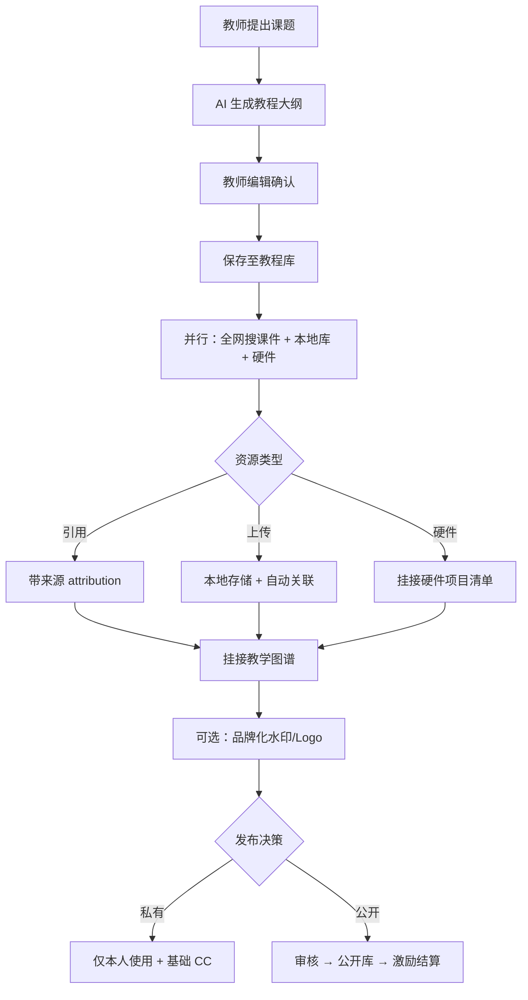

# 09 - 智能STEM课件管理需求升级（v2.1）

> **文档类型**：需求升级 / PRD 增量  
> **版本**：2.1.0  
> **状态**：已批准待开发  
> **最后更新**：2026-06-21  
> **关联计划**：[智能STEM课件管理开发计划](../../.qoder/plans/intelligent-courseware-development-plan.md)

---

## 1. 升级背景

### 1.1 问题陈述

前期桌面端建设侧重「资源浏览 + 学习路径 + 硬件展示」，存在以下与教师核心诉求的偏差：

| 问题 | 影响 |
|------|------|
| 教程、课件、图谱、搜索分散在多个入口 | 教师需在多个页面间切换，难以形成「一课一案」 |
| 全网搜结果难以一键纳入教程 | 发现资源后仍需手工下载、上传、关联 |
| 缺少「课题 → 教程 → 资源匹配」闭环 | 无法支撑从教学意图到可交付课件的完整流程 |
| Blockly 等编辑器集成 | 与产品定位不符——教师已有 PPT/WPS/Canva 等工具 |
| 缺少原创激励体系 | 难以形成 UGC 内容与平台生态 |

### 1.2 战略调整（v2.1）

**产品定位升级**：

> OpenMTSciEd 桌面端对教师的核心价值，从「STEM 资源浏览器」升级为 **「智能STEM课件管理与教学图谱编排平台」**。

**明确不做**：

- ❌ 内置 Blockly / Scratch / 代码 IDE 等教学内容编辑器
- ❌ 在线视频托管与流媒体
- ❌ 实时协作课堂

**明确要做**：

- ✅ 智能全网搜 + 本地库统一检索
- ✅ 课件与教程库自动/半自动关联，挂接教学知识图谱
- ✅ 课题工作室：AI 辅助大纲 → 确认教程 → 匹配课件/硬件 → 品牌化 → 可选发布
- ✅ 原创贡献激励（积分、等级、精选、分成）

### 1.3 与现有实现的关系

| 已有能力（保留并强化） | 调整或降级 |
|------------------------|------------|
| 统一资源库 `/resource-explorer` | 教程库/课件库/资源浏览器已合并 ✅ |
| 知识图谱三 Tab（路径/个性化/搜索） | 作为「挂接目标」，非独立孤岛 |
| 全局搜索 + 智能全网搜 UI | 升级为「可纳入教程」的操作闭环 |
| 课件上传对话框 + Tauri 本地存储 | 扩展自动关联与品牌化导出 |
| 硬件项目列表 | 降级为「课题匹配资源类型」，非编程环境 |
| Blockly 编辑器路由 | **移出主路线图**，标记为 Out of Scope |

---

## 2. 目标用户与核心价值（增量）

### 2.1 教师（Primary Persona）

| 维度 | v2.1 目标 |
|------|-----------|
| 核心任务 | 围绕课题组织教程、匹配课件、挂接图谱、产出个性化教学包 |
| 成功标准 | 30 分钟内完成「课题 → 可授课资源包」；可选发布并获得激励反馈 |
| 主要触点 | 课题工作室、统一资源库、知识图谱、创作者中心 |

### 2.2 学生 / 自学者（Secondary）

继续通过图谱路径、题库、硬件项目学习；消费教师发布或平台精选的教程包。

### 2.3 平台运营 / 管理员

审核 UGC 发布、维护激励规则、精选内容、处理版权投诉。

---

## 3. 功能需求（新增与变更）

### 3.1 FR-ICM-1 智能搜索层

| ID | 需求描述 | 优先级 | 状态 |
|----|----------|--------|------|
| FR-ICM-1.1 | 统一搜索入口：本地教程/课件 + 开源库 + 硬件 + 知识点 | P0 | 🔄 部分（global-search、search-bar 已有） |
| FR-ICM-1.2 | 智能全网搜：STEM 资源检索，带来源、许可证、可信度标注 | P0 | 🔄 部分（smart_search 已有） |
| FR-ICM-1.3 | 搜索结果操作：「加入教程」「引用到课题」「下载/收藏」 | P0 | ⏳ |
| FR-ICM-1.4 | 去重与合并：同一 URL/ISBN/标题相似资源提示 | P1 | ⏳ |
| FR-ICM-1.5 | 搜索历史与热门课题推荐 | P2 | ⏳ |

**验收标准**：用户在搜索结果中点击「加入教程」，无需离开当前流程即可完成关联。

---

### 3.2 FR-ICM-2 教程-课件-图谱关联

| ID | 需求描述 | 优先级 | 状态 |
|----|----------|--------|------|
| FR-ICM-2.1 | 教程 CRUD（本地 Tauri + 云端同步可选） | P0 | ✅ |
| FR-ICM-2.2 | 课件上传、列表、删除（按教程挂载） | P0 | ✅ |
| FR-ICM-2.3 | **自动关联建议**：上传/导入课件时 AI/规则推荐教程与知识点 | P0 | ⏳ |
| FR-ICM-2.4 | 教程确认后自动写入用户教学图谱节点 | P0 | ⏳ |
| FR-ICM-2.5 | 从图谱节点反查关联教程与课件 | P1 | 🔄 |
| FR-ICM-2.6 | 引用型资源强制来源 attribution（许可证字段） | P0 | ⏳ |

**验收标准**：新建教程并上传课件后，图谱中可见对应节点及关联边；引用外链课件必须带来源字段。

---

### 3.3 FR-ICM-3 课题工作室（Topic Studio）

**路由建议**：`/topic-studio`（桌面端）；后端 API 前缀 `/api/v1/topic-studio`

| ID | 需求描述 | 优先级 | 状态 |
|----|----------|--------|------|
| FR-ICM-3.1 | **Step 1 提出课题**：学科、学段、目标、课时、预算、是否含硬件 | P0 | ⏳ |
| FR-ICM-3.2 | **Step 2 AI 生成教程大纲**：学习目标、环节、活动、评价标准 | P0 | ⏳ |
| FR-ICM-3.3 | **Step 3 确认教程**：写入教程库，生成 draft 状态 | P0 | ⏳ |
| FR-ICM-3.4 | **Step 4 智能匹配**：并行全网搜课件 + 本地库 + 硬件项目，AI 排序推荐理由 | P0 | ⏳ |
| FR-ICM-3.5 | **Step 5 编辑与品牌化**：外链引用或上传；水印/校徽/姓名/导读页 | P1 | ⏳ |
| FR-ICM-3.6 | **Step 6 保存与发布**：私有 / 校内 / 平台公开；触发激励 | P0 | ⏳ |
| FR-ICM-3.7 | 工作流草稿自动保存与断点续做 | P1 | ⏳ |
| FR-ICM-3.8 | AI 助理对话面板（改写描述、补元数据、检查图谱完整性） | P1 | ⏳ |

**AI 边界（强制约束）**：

- ✅ 生成：大纲、活动设计、Rubric、检索关键词、元数据建议
- ❌ 不生成：完整可商用课件正文（版权风险）
- ✅ 协助：用户自有内容改写、结构优化

**验收标准**：教师从输入课题到保存含 ≥1 课件引用的教程包，全程在 Topic Studio 内完成，≤6 步。

---

### 3.4 FR-ICM-4 品牌化与导出

| ID | 需求描述 | 优先级 | 状态 |
|----|----------|--------|------|
| FR-ICM-4.1 | 用户品牌模板：Logo、水印文字、页脚版权、封面样式 | P1 | ⏳ |
| FR-ICM-4.2 | 上传 PDF 叠加封面页 + 页脚水印（非侵入式） | P1 | ⏳ |
| FR-ICM-4.3 | 外链资源生成「教师版导读页」PDF | P2 | ⏳ |
| FR-ICM-4.4 | 导出教学包：教程元数据 + 课件清单 + 图谱快照 | P1 | ⏳ |

---

### 3.5 FR-ICM-5 发布与审核

| ID | 需求描述 | 优先级 | 状态 |
|----|----------|--------|------|
| FR-ICM-5.1 | 发布范围：私有 / 校内共享 / 平台公开 | P0 | ⏳ |
| FR-ICM-5.2 | 发布前版权确认勾选（原创/授权/开源标注） | P0 | ⏳ |
| FR-ICM-5.3 | 自动审核：元数据完整度、重复度、来源链 | P0 | ⏳ |
| FR-ICM-5.4 | 人工抽检队列（Admin Web） | P1 | ⏳ |
| FR-ICM-5.5 | 公开资源库浏览与搜索（Website / Desktop） | P1 | ⏳ |

---

### 3.6 FR-ICM-6 原创激励体系

| ID | 需求描述 | 优先级 | 状态 |
|----|----------|--------|------|
| FR-ICM-6.1 | 创课分（CC）积分：行为计分、等级、防刷 | P0 | ⏳ |
| FR-ICM-6.2 | 创作者中心：积分、等级、教程数据、待审核状态 | P0 | ⏳ |
| FR-ICM-6.3 | 数字证书与徽章展示 | P1 | ⏳ |
| FR-ICM-6.4 | 精选榜 / 月度创课榜 | P1 | ⏳ |
| FR-ICM-6.5 | 创作券 / AI 额度 / 分成（Phase 2 物质激励） | P2 | ⏳ |
| FR-ICM-6.6 | 抄袭举报与积分扣罚 | P1 | ⏳ |

**积分规则摘要**（完整规则见 [§5 激励方案](#5-原创激励方案)）：

| 行为 | CC |
|------|-----|
| 保存私有教程 | +10 |
| 上传原创课件 | +30 |
| 挂接 ≥3 知识点 | +15 |
| 发布并通过审核 | +100 |
| 30 天内 ≥10 收藏 | +50 |
| 官方精选 | +200 |
| 抄袭核实 | -500，冻结发布 90 天 |

---

### 3.7 FR-ICM-7 需求变更（Out of Scope）

| 原需求 ID | 原描述 | v2.1 决策 |
|-----------|--------|-----------|
| FR-3.5.3 | Blockly 硬件积木集成 | ❌ **移出范围**；硬件项目仅作匹配资源 |
| FR-3.3.3 | 独立 Resource Browser | ✅ 已合并至统一资源库 |
| FR-3.3.4 | 独立 Search Map | ✅ 已合并至知识图谱 Tab |
| Phase 3「完整 AI 内容生成流水线」 | 泛化描述 | 收窄为 **Topic Studio AI 助理**（大纲/元数据，非正文） |

---

## 4. 端到端用户流程

---

## 5. 原创激励方案

### 5.1 设计原则

1. **低门槛参与**：保存私有教程即有反馈  
2. **高质量高回报**：发布 + 精选 + 被引用进路径权重更高  
3. **可验证贡献**：行为链路与资源 hash 可追溯  
4. **版权合规优先**：激励与审核绑定，抄袭重罚  

### 5.2 贡献类型

| 类型 | 说明 | 激励权重 |
|------|------|----------|
| **原创型** | 用户上传的自有课件 + 原创教程设计 | 高 CC，可参与分成 |
| **策展型** | 引用开源资源 + 本地化导读/活动/评价 | 中 CC，强调增值部分 |
| **图谱型** | 知识点挂接、路径编排 | 中 CC |

### 5.3 等级权益

| 等级 | 累计 CC | 权益 |
|------|---------|------|
| L1 见习创课者 | 0 | 私有保存、AI 基础额度 |
| L2 活跃教师 | 200 | 校内共享、水印模板 1 套 |
| L3 认证创作者 | 800 | 平台发布、优先审核、AI 高级额度 |
| L4 金牌导师 | 2000 | 精选候选、活动邀约、分成资格 |
| L5 平台共建者 | 5000 | 图谱共建投票、年度证书 |

### 5.4 物质激励阶段

| 阶段 | 时间 | 措施 |
|------|------|------|
| Phase A | 0–6 月 | 数字证书、徽章、创课榜、AI 额度 |
| Phase B | 6–12 月 | 创作券、STEM 礼包、校内订阅返利 15% |
| Phase C | 12 月+ | 官方采购、联合署名、赞赏通道 |

### 5.5 防刷机制

- 同文件 hash 重复上传不计分  
- 收藏/下载需登录且去重  
- 新账号 7 天内不可公开发布  
- 激励 T+7 发放，异常可回滚  

---

## 6. 数据模型（增量）

### 6.1 新增实体（建议）

| 实体 | 关键字段 | 存储 |
|------|----------|------|
| `TopicDraft` | user_id, title, subject, grade, goals, steps_json, status | PostgreSQL + 本地 SQLite 缓存 |
| `TutorialPackage` | tutorial_id, materials[], hardware_ids[], graph_node_ids[] | PostgreSQL |
| `ResourceAttribution` | resource_id, source_url, license, author, retrieved_at | PostgreSQL |
| `BrandTemplate` | user_id, logo_path, watermark_text, footer | PostgreSQL / 本地 |
| `CreatorProfile` | user_id, cc_total, level, badges[] | PostgreSQL |
| `CreditLedger` | user_id, action, cc_delta, ref_type, ref_id, created_at | PostgreSQL |
| `PublishRequest` | package_id, scope, status, reviewer_id, reviewed_at | PostgreSQL |

### 6.2 API 增量（建议）

| 方法 | 路径 | 说明 |
|------|------|------|
| POST | `/api/v1/topic-studio/drafts` | 创建/更新课题草稿 |
| POST | `/api/v1/topic-studio/drafts/:id/generate-outline` | AI 生成大纲 |
| POST | `/api/v1/topic-studio/drafts/:id/match-resources` | 匹配课件/硬件 |
| POST | `/api/v1/topic-studio/drafts/:id/confirm` | 确认生成教程包 |
| POST | `/api/v1/topic-studio/packages/:id/publish` | 提交发布 |
| GET | `/api/v1/creators/me` | 创作者中心概览 |
| GET | `/api/v1/creators/leaderboard` | 创课榜 |
| POST | `/api/v1/materials/auto-link` | 课件自动关联建议 |

---

## 7. 非功能需求（增量）

| ID | 需求 | 指标 |
|----|------|------|
| NFR-ICM-1 | Topic Studio 步骤切换响应 | ≤ 500ms（不含 AI） |
| NFR-ICM-2 | AI 大纲生成 | ≤ 30s（流式输出） |
| NFR-ICM-3 | 全网搜超时 | ≤ 15s，可部分结果返回 |
| NFR-ICM-4 | 发布审核 SLA | 自动审核即时；人工 ≤ 72h |
| NFR-ICM-5 | 版权数据保留 | attribution 不可删除，仅可追加 |

---

## 8. 验收标准（v2.1 MVP）

- [ ] 教师可在 Topic Studio 完成 6 步向导并保存教程包  
- [ ] 全网搜结果可「加入教程」  
- [ ] 上传课件后收到自动关联建议（规则版即可）  
- [ ] 确认的教程在知识图谱中可见节点  
- [ ] 发布流程含版权勾选 + 自动审核  
- [ ] 创作者中心展示 CC 积分与等级  
- [ ] Blockly 编辑器不在主导航与需求范围内  

---

## 9. 相关文档

- [功能需求（总表）](./03-functional-requirements.md)
- [用户与场景](./02-users-and-scenarios.md)
- [路线图与实现状态](./07-roadmap-and-status.md)
- [开发计划](../../.qoder/plans/intelligent-courseware-development-plan.md)

---

*文档维护：产品需求变更时同步更新 FR-ICM-* 状态列与 §8 验收清单。*
