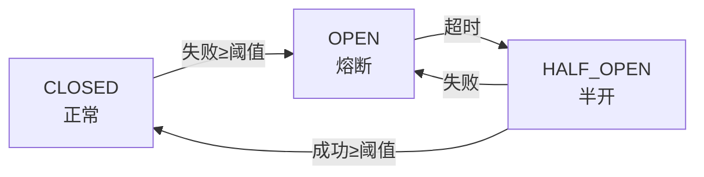

# Sentinel 熔断器集成 - 使用指南

## 📚 概述

Sentinel 熔断器为第三方服务调用提供**容错保护**、**降级策略**和**流量控制**，防止级联故障导致系统雪崩。

---

## 🎯 核心概念

### 熔断器三态



1. **CLOSED（关闭）**: 正常运行，允许所有请求通过
2. **OPEN（打开）**: 熔断状态，拒绝所有请求，直接返回降级响应
3. **HALF_OPEN（半开）**: 超时后进入，允许少量请求测试，根据结果决定恢复或继续熔断

---

## 🚀 快速开始

### 最简单的用法

```python
from backend.middleware.circuit_breaker import circuit_breaker

@circuit_breaker("OpenAI_API", failure_threshold=3, timeout=60)
async def call_openai(prompt: str):
    # 连续失败 3 次后，熔断器打开，60 秒内不再调用
    return await openai.ChatCompletion.create(...)
```

### 带降级的用法

```python
async def fallback_function(*args, **kwargs):
    """降级函数"""
    return {"fallback": True, "message": "服务暂时不可用"}

@circuit_breaker(
    "Payment_Gateway",
    failure_threshold=5,
    timeout=120,
    fallback=fallback_function
)
async def process_payment(order_id: str, amount: float):
    # 失败时自动调用 fallback_function
    return await stripe.charge(...)
```

---

## 📋 详细配置

### CircuitBreakerConfig 参数

```python
config = CircuitBreakerConfig(
    failure_threshold=5,          # 失败次数阈值（默认 5）
    success_threshold=2,          # 半开→关闭需要的成功次数（默认 2）
    timeout=60.0,                # 熔断超时秒数（默认 60）
    half_open_max_calls=3,       # 半开状态最大请求数（默认 3）
    expected_exceptions=(Exception,),  # 预期异常类型
    fallback_function=None,      # 降级函数
)
```

### 完整示例

```python
from backend.middleware.circuit_breaker import (
    CircuitBreaker,
    CircuitBreakerConfig
)

# 自定义配置
config = CircuitBreakerConfig(
    failure_threshold=10,         # 容忍 10 次失败
    success_threshold=5,          # 需要 5 次成功才能恢复
    timeout=180.0,               # 3 分钟超时
    half_open_max_calls=5        # 半开允许 5 个测试请求
)

breaker = CircuitBreaker("Database_Primary", config=config)

@breaker
async def query_database(sql: str):
    return await db.execute(sql)
```

---

## 💡 实际应用场景

### 1. AI 服务保护

```python
async def openai_fallback(prompt: str, **kwargs):
    """OpenAI 降级：保存请求稍后处理"""
    await save_to_queue(prompt)
    return {
        "fallback": True,
        "message": "AI 服务繁忙，已保存请求稍后处理"
    }

@circuit_breaker(
    "OpenAI_API",
    failure_threshold=3,
    timeout=60,
    fallback=openai_fallback
)
async def generate_ai_content(prompt: str):
    return await openai.ChatCompletion.create(
        model="gpt-4",
        messages=[{"role": "user", "content": prompt}]
    )

@router.post("/ai/generate")
async def ai_generate(prompt: str):
    result = await generate_ai_content(prompt)
    
    if result.get("fallback"):
        return {"warning": result["message"]}
    else:
        return result
```

### 2. 支付网关保护

```python
async def payment_fallback(order_id: str, **kwargs):
    """支付降级：排队延迟处理"""
    return {
        "fallback": True,
        "status": "pending",
        "message": "支付系统繁忙，订单已排队",
        "order_id": order_id
    }

@circuit_breaker(
    "Payment_Gateway",
    failure_threshold=5,
    timeout=120,
    fallback=payment_fallback
)
async def charge_payment(order_id: str, amount: float):
    return await stripe.PaymentIntent.create(
        amount=amount,
        currency="usd"
    )
```

### 3. 数据库连接保护

```python
async def db_fallback(query_type: str, **kwargs):
    """数据库降级：使用缓存或队列"""
    cache_key = f"db_cache:{query_type}"
    cached = await redis.get(cache_key)
    
    if cached:
        return json.loads(cached)
    
    return {
        "fallback": True,
        "status": "queued",
        "message": "数据库繁忙，操作已加入队列"
    }

@circuit_breaker(
    "Database_Primary",
    failure_threshold=10,
    timeout=30,
    fallback=db_fallback
)
async def execute_query(query: str, params: dict):
    async with db.acquire() as conn:
        return await conn.execute(query, params)
```

### 4. 外部 API 保护

```python
async def weather_api_fallback(city: str, **kwargs):
    """天气 API 降级：返回缓存数据"""
    cache_key = f"weather:{city}"
    cached = await redis.get(cache_key)
    
    if cached:
        logger.info(f"使用缓存天气数据：{city}")
        return json.loads(cached)
    
    return {
        "fallback": True,
        "message": "天气服务暂时不可用"
    }

@circuit_breaker(
    "Weather_API",
    failure_threshold=3,
    timeout=60,
    fallback=weather_api_fallback
)
async def fetch_weather(city: str):
    async with aiohttp.ClientSession() as session:
        async with session.get(
            f"https://api.weather.com/{city}"
        ) as resp:
            return await resp.json()
```

### 5. 短信服务保护

```python
async def sms_fallback(phone: str, message: str, **kwargs):
    """短信降级：记录日志稍后发送"""
    await log_sms_for_retry(phone, message)
    return {
        "fallback": True,
        "message": "短信系统繁忙，消息已记录稍后发送"
    }

@circuit_breaker(
    "SMS_Service",
    failure_threshold=5,
    timeout=60,
    fallback=sms_fallback
)
async def send_sms(phone: str, message: str):
    return await twilio.messages.create(
        body=message,
        to=phone
    )
```

---

## 🔍 监控和管理

### 查看熔断器状态

```python
from backend.middleware.circuit_breaker import CircuitBreakerManager

manager = CircuitBreakerManager.get_instance()
stats = manager.get_all_stats()

# 返回示例：
# {
#     "OpenAI_API": {
#         "name": "OpenAI_API",
#         "state": "closed",
#         "failure_count": 0,
#         "success_count": 15,
#         "total_calls": 15,
#         "total_failures": 0,
#         "total_successes": 15,
#         "total_fallbacks": 0
#     },
#     "Payment_Gateway": {
#         "name": "Payment_Gateway",
#         "state": "half_open",
#         "failure_count": 5,
#         "success_count": 1,
#         ...
#     }
# }
```

### API 端点监控

```python
@router.get("/circuit-breaker/status")
async def get_circuit_breaker_status():
    """获取所有熔断器状态"""
    manager = CircuitBreakerManager.get_instance()
    return manager.get_all_stats()

@router.post("/circuit-breaker/reset")
async def reset_circuit_breakers(breaker_name: str = None):
    """重置熔断器（手动恢复）"""
    manager = CircuitBreakerManager.get_instance()
    
    if breaker_name:
        breaker = manager.get_breaker(breaker_name)
        breaker._reset_state()
        return {"message": f"{breaker_name} 已重置"}
    else:
        manager.reset_all()
        return {"message": "所有熔断器已重置"}
```

---

## 🛠️ 最佳实践

### 1. 选择合适的失败阈值

```python
# 关键服务（容忍度低）
@circuit_breaker("Payment_Gateway", failure_threshold=3)

# 非关键服务（容忍度高）
@circuit_breaker("Analytics_Service", failure_threshold=10)

# 外部 API（根据 SLA 调整）
@circuit_breaker("Weather_API", failure_threshold=5)
```

### 2. 设置合理的超时时间

```python
# 快速恢复的服务
timeout=30.0  # 30 秒

# 恢复较慢的服务
timeout=120.0  # 2 分钟

# 数据库等核心服务
timeout=60.0   # 1 分钟
```

### 3. 实现智能降级

```python
# ✅ 推荐：有实际意义的降级
async def smart_fallback(user_id: str):
    # 1. 尝试缓存
    cached = await redis.get(f"user:{user_id}")
    if cached:
        return json.loads(cached)
    
    # 2. 尝试备用服务
    try:
        return await backup_service.get_user(user_id)
    except:
        pass
    
    # 3. 返回友好提示
    return {
        "fallback": True,
        "message": "服务暂时不可用，请稍后重试"
    }

# ❌ 不推荐：简单返回空值
async def bad_fallback(*args):
    return None
```

### 4. 记录详细的日志

```python
import logging

logger = logging.getLogger(__name__)

async def logged_fallback(*args, **kwargs):
    logger.warning(
        "熔断器降级触发",
        extra={
            "args": args,
            "kwargs": kwargs,
            "timestamp": datetime.utcnow()
        }
    )
    return {"fallback": True}
```

### 5. 定期检查和清理

```python
# 定时任务：每天检查熔断器状态
@app.on_event("startup")
async def startup_check():
    logger.info("系统启动，重置所有熔断器")
    manager = CircuitBreakerManager.get_instance()
    manager.reset_all()

# 或使用定时任务
async def periodic_reset():
    while True:
        await asyncio.sleep(3600)  # 每小时
        manager = CircuitBreakerManager.get_instance()
        
        # 只重置长时间处于 OPEN 状态的熔断器
        for name, breaker in manager.get_all_breakers().items():
            if breaker.state == CircuitState.OPEN:
                stats = breaker.get_stats()
                last_change = datetime.fromisoformat(stats["last_state_change_time"])
                
                if (datetime.utcnow() - last_change).seconds > 3600:
                    logger.warning(f"强制重置长时间打开的熔断器：{name}")
                    breaker._reset_state()
```

---

## 🧪 测试示例

### 单元测试

```python
import pytest
from backend.middleware.circuit_breaker import CircuitBreaker, CircuitBreakerConfig

@pytest.mark.asyncio
async def test_circuit_breaker_opens_after_failures():
    """测试熔断器在连续失败后打开"""
    breaker = CircuitBreaker(
        "Test_Breaker",
        config=CircuitBreakerConfig(failure_threshold=3)
    )
    
    async def failing_func():
        raise Exception("Always fails")
    
    # 连续失败 3 次
    for i in range(3):
        try:
            await breaker.call(failing_func)
        except Exception:
            pass
    
    # 验证状态
    assert breaker.state == CircuitState.OPEN
    assert breaker.failure_count == 3

@pytest.mark.asyncio
async def test_fallback_called():
    """测试降级函数被调用"""
    fallback_called = False
    
    async def my_fallback(*args, **kwargs):
        nonlocal fallback_called
        fallback_called = True
        return {"fallback": True}
    
    breaker = CircuitBreaker(
        "Test_Fallback",
        config=CircuitBreakerConfig(
            failure_threshold=1,
            fallback_function=my_fallback
        )
    )
    
    async def failing_func():
        raise Exception("Fail")
    
    result = await breaker.call(failing_func)
    
    assert fallback_called == True
    assert result["fallback"] == True
```

### 集成测试

```python
from fastapi.testclient import TestClient

client = TestClient(app)

def test_ai_endpoint_with_circuit_breaker():
    """测试 AI 端点的熔断器行为"""
    # 第一次调用（应该成功）
    response = client.post("/ai/generate", json={"prompt": "test"})
    assert response.status_code == 200
    
    # 模拟多次失败后熔断器打开
    # ...
    
    # 熔断器打开后的请求（应该返回降级响应）
    response = client.post("/ai/generate", json={"prompt": "test"})
    assert response.status_code == 200
    assert response.json()["warning"] is not None
```

---

## ⚠️ 常见错误

### 1. 阈值设置过低

```python
# ❌ 太敏感，网络抖动就熔断
@circuit_breaker("Service", failure_threshold=1)

# ✅ 合理，允许偶尔失败
@circuit_breaker("Service", failure_threshold=5)
```

### 2. 超时时间过短

```python
# ❌ 恢复太快，服务还没好
timeout=5.0

# ✅ 给服务足够恢复时间
timeout=60.0
```

### 3. 没有降级函数

```python
# ❌ 熔断后直接抛异常
@circuit_breaker("Service")

# ✅ 提供友好的降级响应
@circuit_breaker("Service", fallback=my_fallback)
```

### 4. 忽略监控

```python
# ❌ 从不管理熔断器状态

# ✅ 定期检查状态
@router.get("/admin/circuit-breakers")
async def admin_view_breakers():
    return CircuitBreakerManager.get_instance().get_all_stats()
```

---

## 📊 性能优化建议

### 1. 使用异步降级函数

```python
# ✅ 推荐：异步降级
async def async_fallback(*args, **kwargs):
    data = await redis.get("cache_key")
    return json.loads(data) if data else None

# ❌ 不推荐：同步阻塞
def sync_fallback(*args, **kwargs):
    data = redis.get("cache_key")  # 可能阻塞
    return data
```

### 2. 缓存降级响应

```python
from functools import lru_cache

@lru_cache(maxsize=100)
def cached_fallback(service_name: str):
    return {"fallback": True, "service": service_name}

async def smart_fallback(service_name: str, **kwargs):
    return cached_fallback(service_name)
```

### 3. 批量操作的熔断器

```python
# ✅ 为批量操作单独配置
@circuit_breaker("Batch_Processor", failure_threshold=10, timeout=30)
async def batch_process(items):
    results = []
    for item in items:
        try:
            result = await process_single(item)
            results.append(result)
        except Exception as e:
            logger.error(f"单项失败：{e}")
    return results
```

---

**最后更新**: 2026-03-14  
**维护者**: iMato Team
